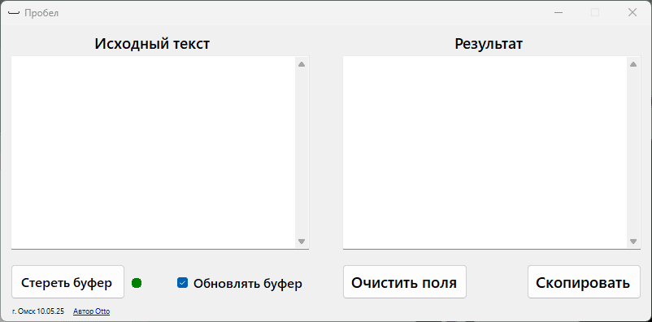
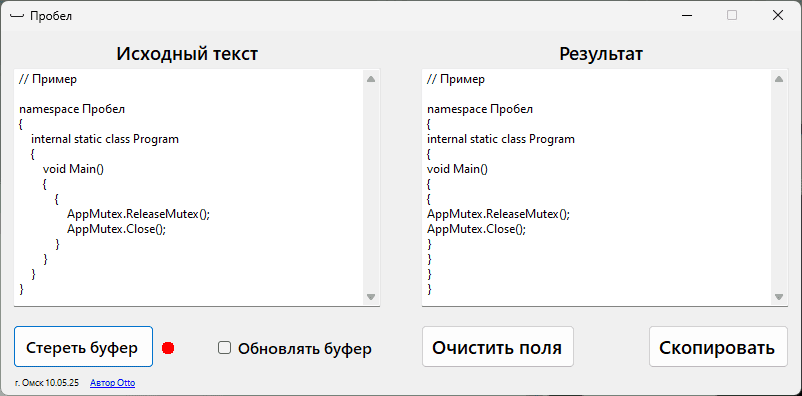
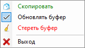

## **Пробел** - Программа для удаления лишних пробелов и табуляций в тексте.

#### Удаляет все лишние пробелы и табуляции, оставляя по одному пробелу между слов, абзацы не удаляются.

Используется _Windows Forms (.NET 8)_

Версия языка C#: _13.0_

_Проект полностью открыт и распространяется по лицензии MIT._

Ссылки на [GitHub](https://github.com/Otto17/Probel) и [GitFlic](https://gitflic.ru/project/otto/probel).

---

_P.S._ Для работы программы требуется “\*\*.NET 8.0 Desktop Runtime (v8.0.15)\*\*”, если он не установлен, то при запуске программы она сама предложен скачать его по прямой ссылке.

---

**Описание:**

В “**Исходное поле**” вставляется неформатированный текст, в поле “**Результат**” сразу же появляется отформатированный текст, который можно скопировать через контекстное меню, выделив нужный фрагмент и сразу весь текст в поле нажатием кнопки “**Скопировать**”.

При установленной галочке “**Обновлять буфер**”, программа постоянно отслеживает буфер обмена, если в нём появляется текст, то он автоматически форматируется и заменяется в буфере обмена, то есть скопировали, где либо текст, и он сразу же стал отформатированным без лишних действий, а так же меняется цвет иконки в трее в зависимости от состояния галочки, для визуального понимания включено ли отслеживание буфера или нет.

Кнопка “**Очистить поля**” просто удаляет текст в обоих полях.

Кнопка “**Стереть буфер**” очищает буфер обмена Windows от ранее скопированного текста, не очищая поля исходного текста и результата.

Красный индикатор означает, что в буфере обмена Windows есть текст, зелёный индикатор означает, что буфер обмена чист. 

При нажатии кнопки свернуть, программа сворачивается в трей, откуда имеет контекстное меню, для быстрого доступа к функциям программы.

Программа запоминает состояние окна (свёрнутое в трей или развёрнуто в окно) и галочки “**Обновлять буфер**”.

При надобности можно поставить программу на автозапуск и оно будет запускаться в свёрнутом виде после авторизации в учётной записи.

---

**Скриншоты:**

****  
****  
****

---

**Автор Otto, г. Омск 2025**